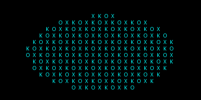
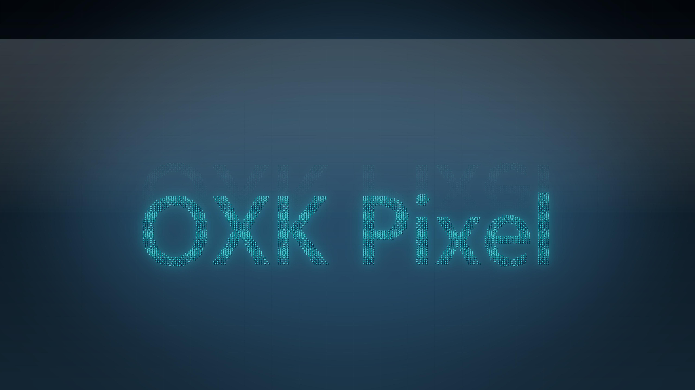
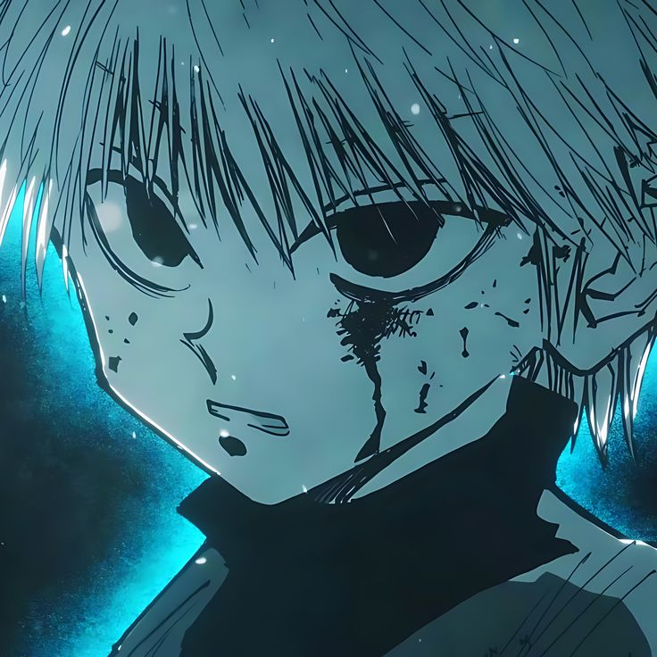

# OXK Pixel

## Brand Assets

## Scripts

- `Logo.py` – pixel-art assets from silhouette
- `create_oxk_logo.py` – glowing OXK banner
- `create_oxk_square.py` – cyan mosaic avatar
- `create_oxk_avatar.py` – grid-aligned avatar
- `create_oxk_banner.py` – YouTube banner
- `create_oxk_brand.py` – high-res brand set