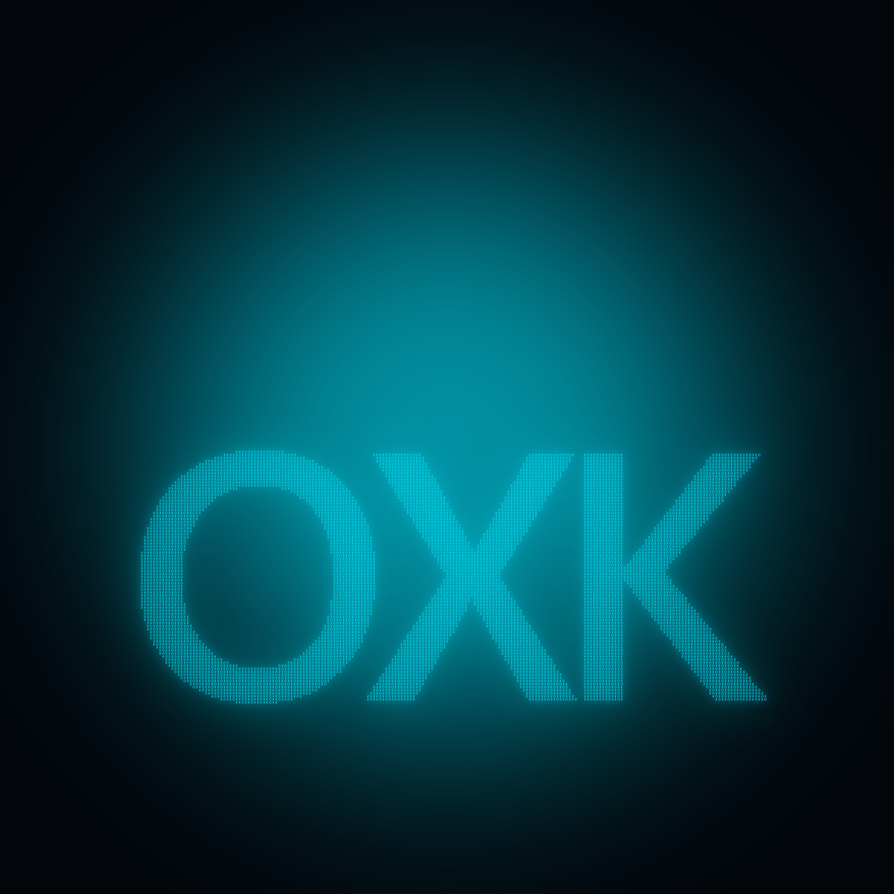
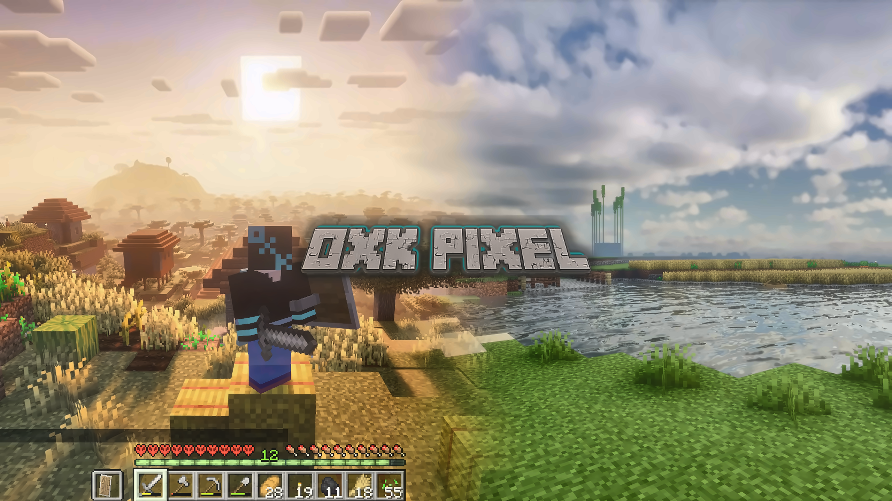
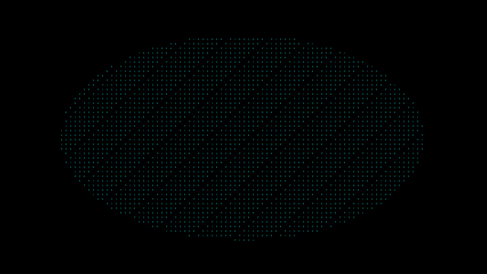
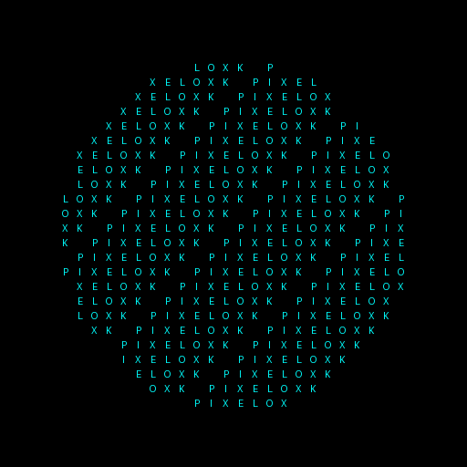
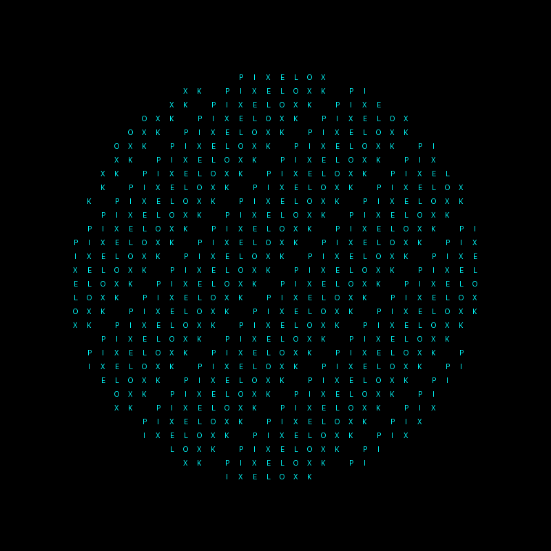
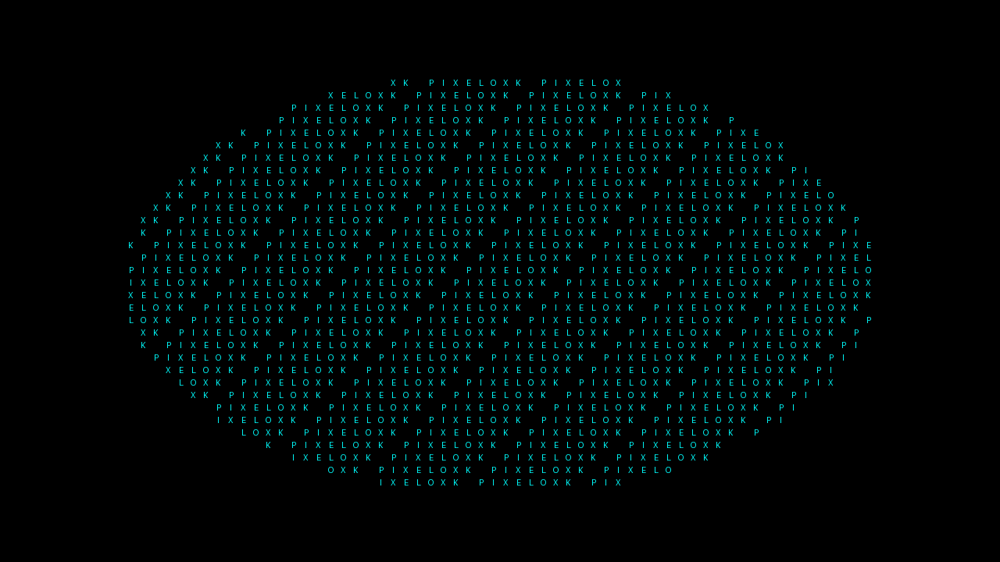

# OXK Pixel

My YouTube channel branding — logos, banners, and pixel-art assets.

## Logo




## Channel Banner





## Hi-Res Banner (5120x2880)


## Avatar & Profile





## Thumbnail



## Scripts

| Script | What it does |
|--------|-------------|
| `Logo.py` | Pixel-art assets from a silhouette (avatar, banner, thumbnail, favicon) |
| `create_oxk_logo.py` | 1600x600 glowing OXK intro banner |
| `create_oxk_square.py` | 800x800 cyan mosaic avatar |
| `create_oxk_avatar.py` | 1024x1024 avatar with grid alignment |
| `create_oxk_banner.py` | 2560x1440 YouTube banner |
| `create_oxk_brand.py` | Full brand set (2048 logo + 5120x2880 banner) |
| `create_oxk_logo_centered.py` | Centered logo variant |

## Generate

```powershell
pip install -r requirements.txt
python Logo.py --text "OXK" --out out
```

## License

MIT
